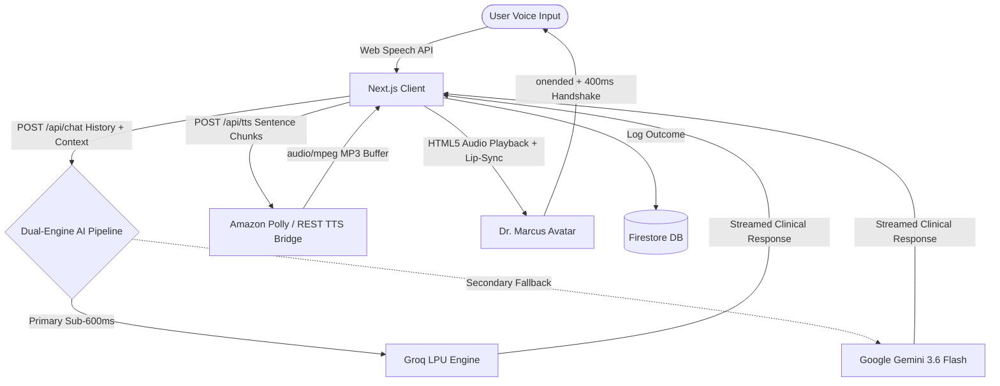

<div align="center">

# 🧠 MindReset AI
### *90-Second Somatic Reset & Real-Time AI Somatic Voice Therapist*

[](https://nextjs.org/)
[](https://www.typescriptlang.org/)
[](https://tailwindcss.com/)
[](https://groq.com/)
[](https://aistudio.google.com/)
[](https://firebase.google.com/)
[](LICENSE)

---

### 🌐 Live Deployment
### 🔗 **[https://mind-reset-ai.vercel.app](https://mind-reset-ai.vercel.app)**
*GitHub Repository:* **[sayakbhattasali/mind-reset-ai](https://github.com/sayakbhattasali/mind-reset-ai)**

---

</div>

## 📖 Overview

**MindReset AI** is a real-time clinical somatic voice therapy application designed to defuse acute distress, cravings, panic, and anxiety in **90 seconds**.

Guided by **Dr. Marcus**—an empathetic AI somatic clinician powered by a resilient dual-engine AI pipeline (Groq LPU primary + Google Gemini fallback) and low-latency audio streams—MindReset guides users through physical nervous system down-regulation (physiological sighs, vagal nerve resets, sensory grounding) through natural voice dialogue and real-time avatar lip-sync.

---

## ✨ Core Features

### 🎙️ 1. Real-Time Conversational Voice Therapist
- **Strict Half-Duplex Turn-Taking**: Zero microphone feedback loops; the microphone hardware activates strictly after Dr. Marcus finishes speaking.
- **Deep Clinical Male Voice**: Guaranteed masculine clinician voice across laptops, iPhones, and Android devices via high-speed zero-key serverless audio streaming.
- **Microphone Echo Isolation**: 400ms controlled handshake prevents Dr. Marcus's voice from echoing into speech recognition.

### 👤 2. Procedural Human Avatar (Dr. Marcus)
- **Interactive Somatic Avatar**: Real-time responsive visual clinician with organic double-blinking, attentive eye gaze saccades, idle micro-breathing motion, and expressive listening states.
- **Real-Time Lip-Sync**: Dynamic jaw and mouth oscillation synchronized directly to audio playback events.

### ⚡ 3. Resilient Dual-Engine AI Architecture
- **Primary: Groq LPUs (<600ms)**: Blazing-fast inference via `qwen/qwen3.8-27b`, `groq/compound-mini`, and `llama-3.3-70b-versatile`.
- **Secondary: Google Gemini Fallback**: Seamless, automatic rollover to `gemini-3.6-flash` via `@google/genai` if Groq ever faces rate limits or outages.
- Concise, grounding clinical dialogues tailored to urge intensity (1–10 scale).

### 📊 4. Clinical Intake & Relief Assessment
- **Pre-Session Calibration**: 1–10 Urge/Distress severity slider with categorized trigger selection (Anxiety, Craving, Rage, Panic, Burnout).
- **Post-Session Evaluation**: Immediate calculation of percentage urge reduction with persistent cloud session logging.

### 🔐 5. Anonymous-to-Authenticated Cloud Sync
- Seamless guest access with instant Firebase Google Auth claiming to preserve session relief history across devices.

---

## 🛠️ Architecture & Data Flow



---

## 💻 Tech Stack

| Layer | Technologies |
| :--- | :--- |
| **Framework** | Next.js 14 (App Router), React 18, TypeScript |
| **Visuals & Animation** | Framer Motion, HTML5 Canvas, SVG Procedural Shaders |
| **Styling & UI** | TailwindCSS, Lucide Icons |
| **Primary AI Engine** | Groq Cloud SDK (`qwen/qwen3.8-27b`, `groq/compound-mini`, `llama-3.3-70b-versatile`) |
| **Fallback AI Engine**| Google GenAI SDK (`gemini-3.6-flash`) |
| **Audio & Speech** | Serverless REST Audio Stream (Polly Brian), Web Speech API, HTML5 Audio |
| **Database & Auth** | Google Firebase (Authentication & Cloud Firestore) |

---

## 🚀 Getting Started

### Prerequisites
- **Node.js**: v18.18.0 or later
- **npm** / **pnpm** / **yarn**
- Free **[Groq API Key](https://console.groq.com)**
- Free **[Google Gemini API Key](https://aistudio.google.com)**
- Free **[Firebase Project](https://console.firebase.google.com)**

### Installation

1. **Clone the Repository:**
   ```bash
   git clone https://github.com/sayakbhattasali/mind-reset-ai.git
   cd mind-reset-ai
   ```

2. **Install Dependencies:**
   ```bash
   npm install
   ```

3. **Configure Environment Variables:**
   Create a `.env.local` file in the root directory:
   ```env
   # Primary AI Engine - Groq (https://console.groq.com)
   GROQ_API_KEY=gsk_your_groq_api_key_here

   # Secondary Fallback AI Engine - Google Gemini (https://aistudio.google.com)
   GEMINI_API_KEY=your_gemini_api_key_here

   # Firebase Configuration (https://console.firebase.google.com)
   NEXT_PUBLIC_FIREBASE_API_KEY=your_firebase_api_key
   NEXT_PUBLIC_FIREBASE_AUTH_DOMAIN=your_project.firebaseapp.com
   NEXT_PUBLIC_FIREBASE_PROJECT_ID=your_project_id
   NEXT_PUBLIC_FIREBASE_STORAGE_BUCKET=your_project.firebasestorage.app
   NEXT_PUBLIC_FIREBASE_MESSAGING_SENDER_ID=your_messaging_sender_id
   NEXT_PUBLIC_FIREBASE_APP_ID=your_app_id
   NEXT_PUBLIC_FIREBASE_MEASUREMENT_ID=your_measurement_id
   ```

4. **Run Development Server:**
   ```bash
   npm run dev
   ```
   Open **[http://localhost:3000](http://localhost:3000)** in your browser.

5. **Build for Production:**
   ```bash
   npm run build
   npm run start
   ```

---

## 📂 Project Structure

```text
mind-reset-ai/
├── app/
│   ├── api/
│   │   ├── chat/route.ts       # Groq stream handler & somatic prompt engine
│   │   └── tts/route.ts        # Zero-key male voice REST MP3 generator
│   ├── session/page.tsx        # Somatic therapy session & calibration flow
│   ├── protocols/page.tsx      # Emergency somatic reset protocols
│   ├── how-it-works/page.tsx   # Neurobiology & clinical mechanics
│   ├── about/page.tsx          # Clinical mission & team overview
│   ├── account/page.tsx        # Authenticated user telemetry & history
│   ├── layout.tsx              # Root layout & theme providers
│   └── page.tsx                # High-conversion landing page
├── components/
│   ├── HumanAvatar.tsx         # Procedural 3D humanoid avatar with lip-sync
│   ├── HeroSection.tsx         # Hero section & somatic trigger selectors
│   ├── Navbar.tsx              # Navigation bar with auth status
│   ├── ProtocolCard.tsx        # Interactive protocol selection cards
│   └── Footer.tsx              # Application footer
├── hooks/
│   └── useVoiceTherapist.ts    # Half-duplex voice state machine & mic manager
├── lib/
│   ├── firebase.ts             # Firebase client SDK initialization & Firestore
│   ├── protocols.ts            # Clinical reset protocol data
│   └── speech.ts               # Audio playback & acoustic helpers
└── public/
    ├── mind-reset-bg.webp      # Premium ambient gradient background
    └── mind-reset-logo.png     # MindReset brand asset
```

---

## 🔒 Security & Privacy

- **No Stored Transcripts**: Vocal interactions are processed in volatile memory and never retained for ad profiling.
- **Client-Side Synthesis Guard**: User speech recognition stays local to the client browser until submitted to the clinical pipeline.
- **Environment Isolation**: Private API keys are strictly confined to serverless API routes.

---

## 📄 License

Distributed under the **MIT License**. See `LICENSE` for more information.

---

<div align="center">
  <sub>Built by Sayak Bhattasali.</sub>
</div>
